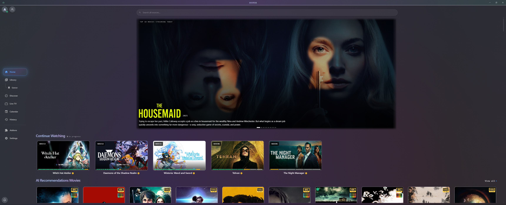
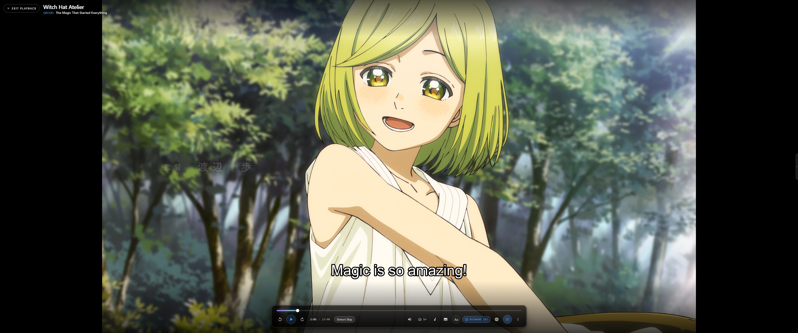
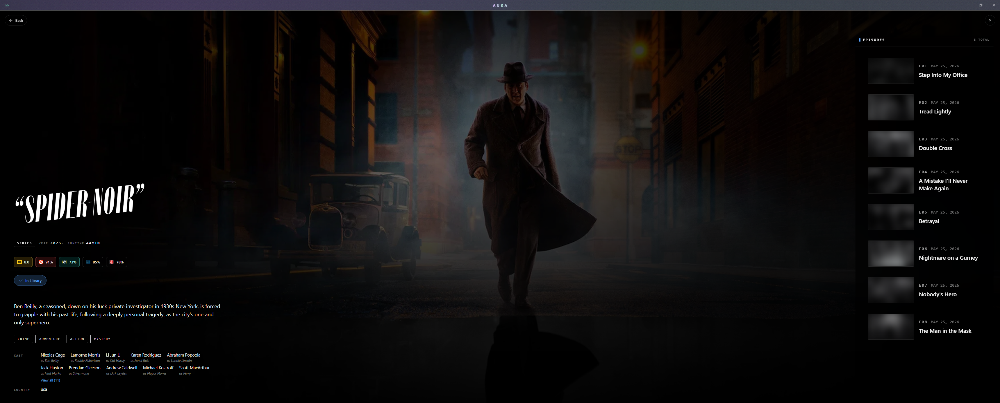
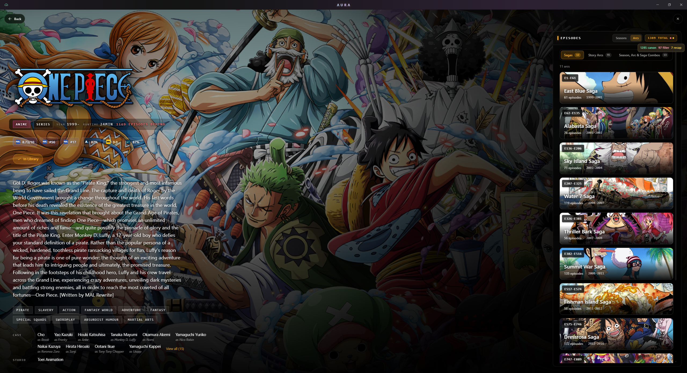
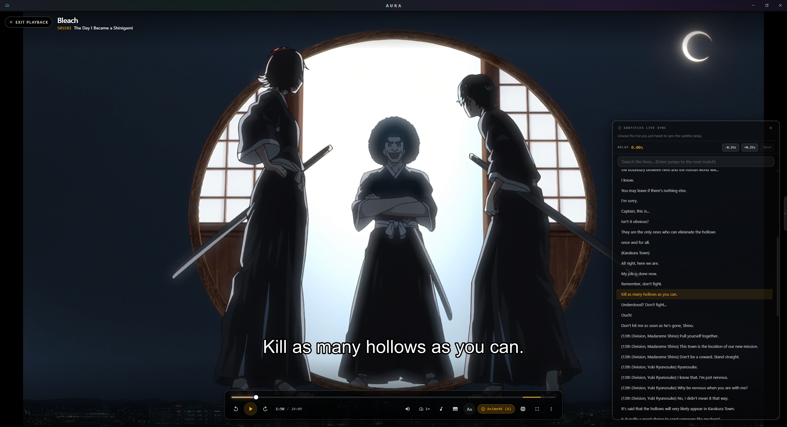
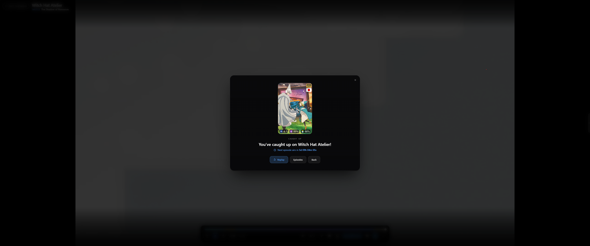
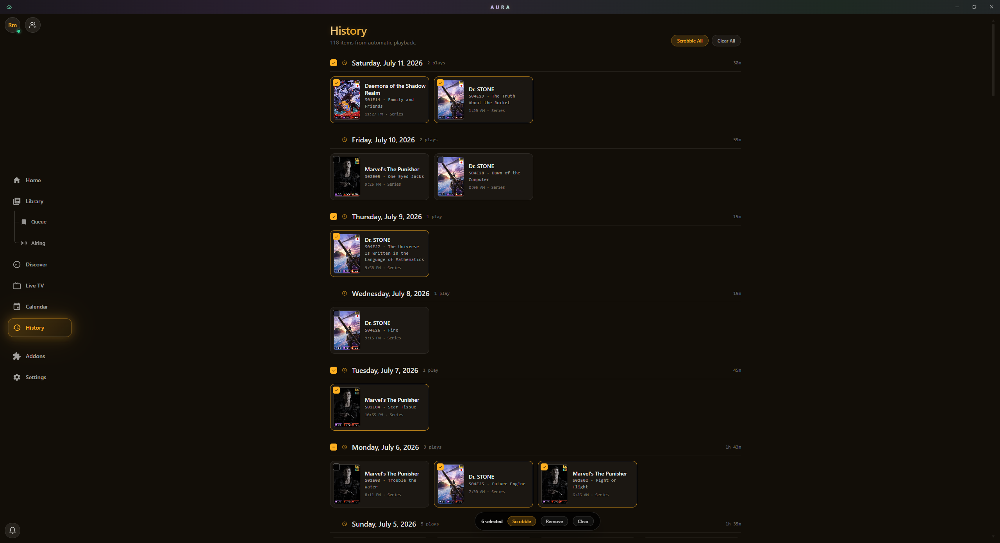
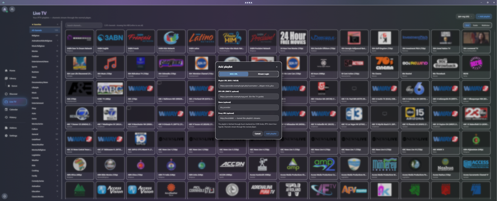
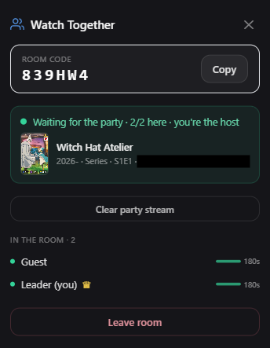

<h1 align="center">Aura</h1>

<p align="center">
  <strong>A cinematic desktop media player for Windows that turns the Stremio addon ecosystem into a polished, native viewing experience.</strong>
</p>

<p align="center">
  
  
  
</p>

<!--
SCREENSHOT 1 (hero): docs/screenshots/home.png
Capture the Home view on an ULTRAWIDE display (ideally 3440x1440) so the 21:9 hero carousel
and the wide multi-column catalog rows are both visible. Pick a colorful featured title in the
hero. This is the showcase image, so make it look its best: a populated library, a few catalog
rows beneath the hero, the glass title bar at the top. Landscape orientation, high resolution.
-->
<p align="center">
  
</p>

Aura is a native Win32 application (no browser chrome, transparent webview, libmpv embedded as a
child window) that plays anything the Stremio addon ecosystem can resolve: movies, series, anime,
and live TV. It pairs a serious playback engine with a discovery layer of catalogs, ratings, and
release tracking, and it was **built with ultrawide displays in mind** from the start.

> Aura streams through community Stremio addons. It has no native torrent engine; any debrid or
> torrent resolution is provided by the addons you install.

---

## Playback engine

A single libmpv instance is embedded directly through FFI and driven by a dedicated engine thread,
giving Aura full control over the video pipeline.

- **GPU video pipeline** built on `vo=gpu-next` (libplacebo) over a Direct3D 11 context, with
  automatic hardware decoding (NVDEC, D3D11VA, DXVA) for smooth 4K HEVC and VP9.
- **HDR passthrough** with off, SDR, and passthrough modes. Passthrough routes HDR labelled streams
  to a PQ output and honors a configurable target peak (useful for OLED True Black panels).
- **Anime4K and custom GLSL shaders** through a cinema shader pipeline, with per title persistence
  and quick profile switching.
- **Loudness normalization** that levels volume between sources without crushing dynamics,
  toggleable live. It uses a realtime dynamic normalizer rather than EBU R128, so an opening skip
  or any other seek does not replay a few seconds at the wrong level.
- **GPU motion interpolation** using mpv display resampling with selectable kernels. On by default
  and applied to anime only, since it adds judder on live action.
- **Hover seek thumbnails** that preview the frame under the scrubber before you commit a seek.
- **Per track control**: audio, video, and subtitle selection, plus audio and subtitle delay nudges.
- **Subtitle styling** in player: size, position, outline, glyph color, background, and font, applied
  instantly and remembered.
- Playback speed from 0.5x to 4x, frame stepping, pan and scan (zoom to fill), and native Win32
  fullscreen that fills the whole monitor rather than the work area.
- A **performance overlay** (backtick key) showing codec, bitrate, cache fill, dropped frames, HDR
  signal, and A/V sync, plus tuned streaming buffers and reconnect handling for flaky hosts.
- Resume from last position, per title settings persistence, and display sleep inhibition while
  playing.

<!--
SCREENSHOT 2 (player): docs/screenshots/player.png
Capture the player overlay during playback with the control bar visible. Ideally show the scrubber
with amber AniSkip/skip bands on it, the bottom transport controls, and a visible subtitle line.
A vivid, high-bitrate scene (anime or a film) reads best. The "More" menu open in a second shot is
optional but nice.
-->
<p align="center">
  
</p>

## Streaming and sources

- **Stremio addon ecosystem**: install, remove, reorder, and refresh addons; addon lists sync to
  your Stremio account when signed in.
- **Multi addon stream fan out** that queries every compatible addon in parallel, with manifest aware
  gating so addons are only asked for the types and id ranges they support.
- **Rich quality chips** parsed from stream metadata: resolution, rip type, codec, HDR and Dolby
  Vision, audio (Atmos, DDP) and channel layout, size, seeders, language, release group, and debrid
  cache hints (cached vs uncached) with service badges.
- **Source switcher** that swaps to a different source in place from inside the player, resuming at
  your current position without leaving playback.
- **Debrid support** through addons (RealDebrid, TorBox, Premiumize, and similar), with debrid tokens
  redacted from logs and exports.
- An **in process streaming bridge** on a loopback port proxies plain HTTP byte ranges, while HTTPS
  and HLS streams go straight to the player to preserve TLS and relative segment resolution.

## Discovery and library

- **Catalog home rows** ("Cinema Flow") plus a **Discover** view that reaches catalogs hidden from
  home, and **per addon search** that fans out in parallel and fills in results as they arrive.
- **Mini meta hover panel** (Kai style) that surfaces synopsis, ratings, cast, runtime, genres, and
  release countdowns when you hover a poster, with hover, button, and press and hold activation modes.
- **Continue Watching** with per season segmented progress bars, plus a **Calendar** of upcoming and
  recent releases, a drag to reorder **Queue**, a day grouped **History** view, and an **Airing** page
  that gathers the shows you follow that are currently putting out episodes, with an episodes behind
  badge and grouping by air window.
- **Filter and sort** controls (year range, genre, sort order) on Library, Queue, Discover, Search,
  and the view-all catalog page, plus a Library status filter (watched, unwatched, in progress, in
  queue, new episodes), a currently airing only toggle on Library and Queue, and manual marks for
  watched, in progress, and planned.
- **Spoiler controls** that blur unwatched episode thumbnails and episode synopses, plus an option
  to hide the per actor episode counts and Main / Recurring / Guest tier on the cast hover card.
- Lazy loaded, virtualized poster grids that stay light on memory even on very wide layouts.

## Ratings

- A **multi source ratings aggregator** that merges MDBList (IMDb, Rotten Tomatoes audience,
  Metacritic, TMDB, Trakt, Letterboxd) with MyAnimeList (Jikan) and AniList for anime, on top of any
  addon supplied scores.
- Rendered as branded tiles with **per source logos** and critic vs audience tooltips, ordered by
  source authority. The IMDb, RT, and Metacritic tier needs no user supplied key.
- **Accurate movie release dates** (theatrical and digital) from MDBList, an "In Theaters" tag, and
  next episode and digital release countdowns.

<!--
SCREENSHOT 3 (discovery + ratings): docs/screenshots/detail.png
Capture a title Detail page for a well known movie or anime so the rating tiles (IMDb, RT, MAL,
AniList logos), the synopsis, cast row, and the streams list grouped by addon with quality chips are
all visible. Alternatively, capture a catalog poster with the mini-meta hover panel open. Choose
whichever reads as the richest single image of Aura's discovery layer.
-->
<p align="center">
  
</p>

## Anime and skip tooling

- **AuraSkip**, the in player skip system, with per window modes (off, prompt, auto) for openings,
  endings, and recaps, amber skip bands on the scrubber, and in app submission and voting back to
  the AniSkip community database that supplies its anime timestamps.
- **OP and ED skip for any series**, not just anime: titled chapters are honored directly, and a
  heuristic detects likely opening and ending chapters when they are untitled.
- **Hybrid Mode** that scans the tail of a stream with black detection and silence detection to find
  ending boundaries for live action or unchaptered content, plus a silence detect pass over the
  first ten minutes that infers a missing opening. Both run automatically whenever AniSkip and
  chapters leave a gap, so there is no manual probe, and an Automatic skip detection toggle in
  Settings turns them off. These use ffmpeg, which is fetched on demand and degrades cleanly when
  absent.
- **PublicMetaDB** skip windows for live action series, and **filler and recap** skipping in Next Up
  driven by AIOMetadata flags.
- Cour aware MyAnimeList resolution so multi season anime map to the correct entry.
- **Story Arcs** for long running anime: a Seasons and Arcs toggle on the Detail page that regroups
  the episode list into narrative arcs, with a switcher for broader sagas or combined cuts where a
  show defines them. Each arc is a tile with Fandom key art, its episode and year range, and your
  watch progress, and the current arc carries onto the Next Up card and the End of Season Spotlight.
  Arcs come from TMDB episode groups aligned to your addon's real episodes (by sequence, not by
  episode number), so they appear only for the shows that have them. The feature needs a TMDB key
  (baked in, or your own under Settings > API Keys) and is inert without one.

<p align="center">
  
</p>

## Subtitles

- **OpenSubtitles** search accelerated by MovieHash file matching, with a "Hash match" badge on
  frame accurate results and a clean fallback to query search.
- **One click attach** of any subtitle into the running player, plus subtitle fan out from your
  installed Stremio subtitle addons merged alongside embedded tracks.
- Preferred language selection with smart auto pick, an optional language allowlist, live delay, and
  the in player styling described above.
- **Live Subtitle Sync** in the player: pick the line you just heard from a scrollable cue list and
  Aura computes and applies the delay for you, no counting seconds by hand. It works on embedded
  container tracks as well as external files (Stremio's own sync only handles external tracks), and a
  two point mode takes a second anchor further into the episode to correct framerate drift through
  mpv's subtitle speed, with a one click undo if a correction is not what you wanted.

<p align="center">
  
</p>

## Notifications and end of season

- **Cloud driven release notifications** that stack multiple aired episodes between sessions (not just
  the latest one), with a persistent bell panel that survives reboots and cross checks your library so
  watched shows do not re notify.
- An **End of Season Spotlight** overlay at playback end: a Next Up card with optional auto advance
  countdown and spoiler gating, an end card for finales, or a caught up card with a live countdown
  to the next episode's air date.
- An **episode drawer** for quick season and episode navigation from inside the player, and a manual
  library refresh that nudges the release poller on demand.

<!--
SCREENSHOT 4 (end of season): docs/screenshots/eos-spotlight.png
Capture the End of Season Spotlight overlay at the end of an episode: the Next Up card with the next
episode's art, the SxxEyy tag and title, the synopsis, and the Play Next button (with its countdown
ring if you can trigger auto-advance). The dark scrim over a paused frame looks cinematic.
-->
<p align="center">
  
</p>

## Scrobbling

- **Trakt** (OAuth device flow) and **AniList** (GraphQL) scrobbling, both authorized in your
  default browser, where your provider session already lives. For Trakt, Aura shows a short code
  and a QR so you can approve from a phone; AniList comes back through a loopback callback on
  Aura's local bridge. Signing in through an in app popup stays available as a fallback.
- Cour aware anime mapping with absolute episode fallbacks, completion gates (80 percent plus real
  elapsed time) to avoid false marks, proactive token refresh, and expiry alerts.
- **Automatic scrobbling on by default**, with a separate toggle to turn it off if you would rather
  decide what gets recorded yourself, plus a master switch that silences all scrobble traffic.
- **Manual scrobble from History**: every row has a Scrobble to Trakt button (and a Scrobble to
  AniList button for anime) that pushes the play backdated to when you actually watched it, so a
  session where automatic scrobbling was off, or a title one service missed, can still be recorded
  after the fact (Trakt to the exact watch time, AniList to the day).
- **Scrobble All and bulk scrobbling**: send your entire history at once, or select individual rows
  (or every play on a given date) and scrobble or remove them together. Runs are paced with backoff
  so a large history does not trip a service rate limit, keep going if you leave the History page, and
  ask before you close Aura mid run. Items a service has already refused are retired rather than
  retried, and anything already recorded is skipped.

<p align="center">
  
</p>

## Casting

- Discover and cast to **Chromecast** (Cast protocol) and **DLNA** TVs (Samsung, LG, Sony, Panasonic,
  Hisense) over the LAN, with a device picker and a floating cast control bar.
- **On the fly HLS transmux** for containers a Chromecast cannot play natively (MKV, AVI, and similar),
  using ffmpeg and ffprobe with codec aware planning and resume aware seeking.
- Clean handoff: local playback pauses while casting and resumes at the device position when you stop.

## Live TV

- Add **M3U playlists** and **Xtream Codes** accounts (credentials stored in the OS keyring), each
  with optional XMLTV program guides.
- A full **EPG program guide** with a sticky channel column, a live now line and LIVE pill, programme
  hover cards, and infinite scroll.
- **Multiview** of 2, 3, or 4 channels at once, cross playlist **favorites**, group filtering, search,
  now and next on every channel card, a per playlist proxy option, and live rewind with a jump back to
  live.

<!--
SCREENSHOT 5 (live TV): docs/screenshots/live-tv.png
Capture the EPG program guide grid with the red "now" line and LIVE pill visible, channel logos down
the left, and programme blocks across the timeline. Alternatively, capture the multiview grid with
2x2 channels playing. The guide grid is the more distinctive shot.
-->
<p align="center">
  
</p>

## Watch Together

- Create or join **synced watch parties** (shareable room codes, up to a dozen members) relayed
  through Cloudflare Workers and Durable Objects.
- **Leader authoritative** playback: only the host plays, pauses, or seeks, with a crown indicator and
  the ability to hand off the host role.
- **Title gated sync** with a staging banner while the party gathers on the same title, **per member
  buffer** health, activity toasts from the party icon, and a **Vote to Watch** flow for picking the
  next title democratically.

<!--
SCREENSHOT 6 (watch together): docs/screenshots/watch-together.png
Capture the party panel open: the room code with its copy button, the member roster with sync status
dots (and a crown on the host), the party media card, and ideally a couple of members shown. If you
can stage two clients, showing the "Make host" control on hover is a bonus.
-->
<p align="center">
  
</p>

## Stremio account and cloud sync

- Sign in with your **Stremio** account by email and password, or with **Facebook** or **Apple**
  through Stremio's device link code flow: Aura shows a short code and a QR, and you finish on
  Stremio's own sign in page in a browser or on your phone. The session is stored in the Windows
  Credential Manager.
- **Library normalization** collapses legacy per episode entries into clean series rooted records, so
  Library, Continue Watching, and Calendar all read consistent state.
- **Aura Cloud Sync** mirrors per account settings, manual marks, queue order, search history, and
  per title preferences across installs, with conditional fetches and conflict aware merging. Each
  signed in account is fully isolated on a shared machine.

## OS integration

- **Discord Rich Presence** for playback and browsing, with privacy controls (global toggle, hide
  titles, suppress browse states, and a per title blocklist).
- **Windows SMTC** media controls: play, pause, and next or previous episode from the volume flyout,
  lock screen, and media keys, with title, artwork, and position shown in the Windows overlay.
- A **signed auto updater** (minisign verified) that fetches a signed manifest from GitHub Releases and
  installs updates in place.
- **On demand runtime binaries**: the mpv core, ffmpeg, ffprobe, and yt-dlp (trailer playback) are
  downloaded the first time they are needed (SHA-256 verified, stored in a per user directory that
  survives updates) instead of being bundled, which keeps the installer and every update small. A
  first run gate fetches the playback engine before playback starts.
- A **first run onboarding wizard** (import settings, choose preferences, install recommended addons),
  a **minimize to tray on close** option, and automatic pause when the window is minimized (skipped
  while casting or while in a synced watch party, so those keep running).

## Design and ultrawide support

- **Native frameless chrome** with a custom glass title bar, a GPU accelerated spectral gradient sweep,
  and a transparent WebView2 that lets the Windows 11 Mica or Acrylic backdrop show through.
- A **glass morphism design system** with twelve built in themes (Mica, Glass, Midnight for OLED,
  Ember, Forest, Rose, Amethyst, Ocean, Solar, Crimson, and two high contrast themes in gold and
  azure), each with its own palette and glass layers.
- **Built for ultrawide**: a dedicated breakpoint at 2400px and above expands the hero carousel to a
  21:9 cinematic banner and widens catalog rows to ten columns with larger gaps, while Continue
  Watching and the full catalog grids scale their column counts up on very wide displays and back down
  on standard 1080p and 1440p panels so nothing ever feels stretched or cramped.

## Power user and developer tools

- **F12 DevConsole**: a ring buffer log viewer aggregating Rust, React, and app logs, with level
  filters, search, and copy or download, plus a command prompt in development builds.
- A **performance overlay** for live playback diagnostics, fully **rebindable keyboard shortcuts**
  (including chords), **settings export and import**, manual **user data snapshots**, and a **storage
  report** with clearable caches.
- **Opt in crash reporting** (Sentry) for uncaught errors and native crashes, disabled by default and
  asked for once on first launch.

---

## Building from source

Prerequisites:

- Rust (stable, edition 2021)
- Node.js with pnpm
- Windows 10 or 11 (the primary and only fully supported target)

The mpv core is not committed to the repo (it is over 100 MB). For development, drop the libmpv DLL
into `src-tauri/lib/`:

- `libmpv-2.dll` from <https://github.com/zhongfly/mpv-winbuild>

End user installs download `libmpv-2.dll` automatically on first run, so it is not shipped in the
installer. The optional `ffmpeg.exe` (silence and black detection), `ffprobe.exe` (cast transmux),
and `yt-dlp.exe` (trailers) are likewise fetched on demand at runtime; for development you can drop
them into `src-tauri/lib/` as
well, and the app will use those copies if present. Without them, the features that need them degrade
cleanly rather than failing.

Then:

```
pnpm install
pnpm tauri dev
```

Useful checks (the only correctness gates in this project):

```
pnpm exec tsc --noEmit          # type-check the frontend
cd src-tauri && cargo check     # check the Rust host
```

### Streaming bridge (built in)

Aura runs a small loopback server on `127.0.0.1:11471`. It forwards plain HTTP stream byte ranges,
resizes and caches posters on device, and hosts the page that a browser sign in redirects back to. It
is in process (part of the main executable, nothing to install or run separately). HTTPS streams and
HLS manifests bypass it entirely and go straight to the player. If the port is already in use, the
server disables itself gracefully (a warning is logged to the F12 DevConsole): HTTPS and HLS playback
is unaffected, and browser sign in falls back to signing in inside Aura.

## License

This project uses split licensing.

- **Code** is licensed under the **GNU Affero General Public License, version 3 or any later version
  (AGPL-3.0-or-later)**, see [`LICENSE`](LICENSE) for the full text. In short: you may redistribute
  and modify the code, but any network deployed modification (or distributed binary) must publish its
  source under the same license.

- **Branding** (the Aura name, the Aura "A" logo in `src/AuraLogoA.tsx` and `src-tauri/icons/*`, and
  any associated wordmark or logotype) is licensed separately under **Creative Commons
  Attribution-NonCommercial 4.0 International (CC-BY-NC-4.0)**, see [`LICENSE-ASSETS`](LICENSE-ASSETS)
  for the full text and the exact list of covered paths. Forks intending to ship a commercial product
  must replace these branding assets with their own.

## Contact

For licensing questions, security reports, or anything else relating to this project:

- **Electronic mail:** [contact@animasec.dev](mailto:contact@animasec.dev)
- **Postal mail:** *intentionally omitted*
